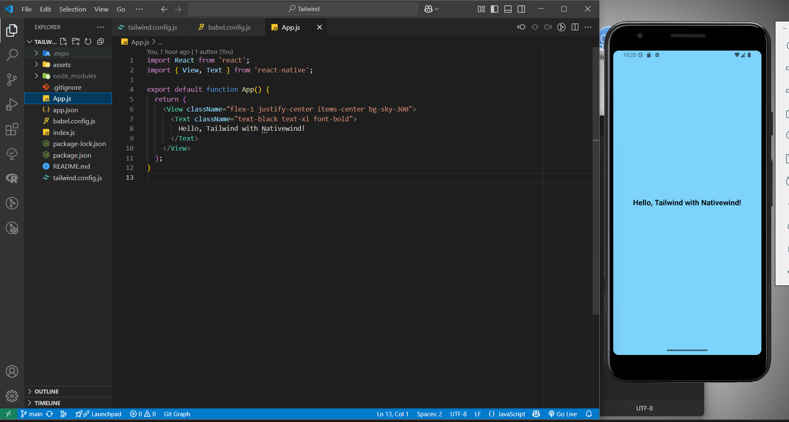

#   **React Native Expo + Tailwind CSS (NativeWind) With JavaScript Setup**  
### _Blazing-Fast Utility-First Styling for React Native_ ⚡  


---

## 🚀 **Getting Started**

### 🧰 **Prerequisites**
- Node.js (v14+)
- npm or yarn
- Expo CLI (`npm install -g expo-cli`)

---

## 🛠️ **Setup Guide**

### 📦 **1. Create Expo Project**
```bash
npx create-expo-app my-app --template blank
cd my-app
```

### 📦 **2. Install Dependencies**
```bash
npm install nativewind@2.0.11
npm install --save-dev tailwindcss@3.3.2
npm install react-native-svg
```

### 📦 **3. Initialize Tailwind CSS**
```bash
npx tailwindcss init
```

Update the `tailwind.config.js` file:
```js
/** @type {import('tailwindcss').Config} */
module.exports = {
  content: [
    './App.js',
    './components/**/*.{js,jsx}',
    './screens/**/*.{js,jsx}',
  ],
  theme: {
    extend: {},
  },
  plugins: [],
};
```

### 📦 **4. Update Babel Configuration**
Update `babel.config.js`:
```js
module.exports = {
  presets: ['babel-preset-expo'],
  plugins: ['nativewind/babel'],
};
```

---

## 🏃 **Run the Project**
Start the development server:
```bash
npm start
```

---

## 📂 **Project Structure**
```
├── App.js
├── assets/
│   ├── adaptive-icon.png
│   ├── favicon.png
│   ├── icon.png
│   └── splash-icon.png
├── babel.config.js
├── index.js
├── package.json
├── tailwind.config.js
└── .gitignore
```

---

## 🎨 **Using Tailwind CSS**
You can now use Tailwind CSS classes in your React Native components. For example:
```jsx
import React from 'react';
import { View, Text } from 'react-native';

export default function App() {
  return (
    <View className="flex-1 justify-center items-center bg-sky-300">
      <Text className="text-black text-xl font-bold">
        Hello, Tailwind with Nativewind!
      </Text>
    </View>
  );
}
```
## ScreenShot :

